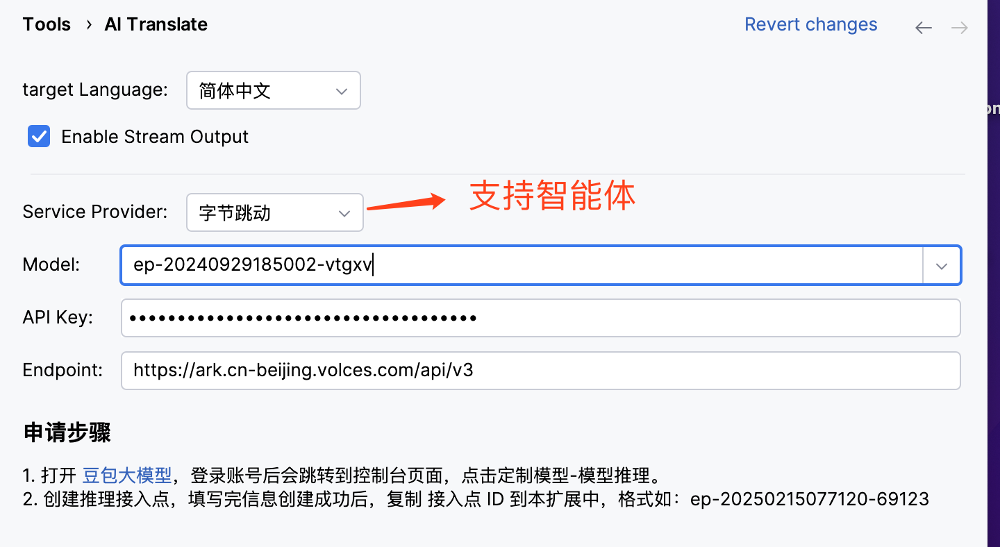

# ai-translate

    

## 项目简介

<!-- Plugin description -->

这是一款基于LLM的编程开发者翻译助手。旨在帮助开发人员快速将英文翻译成中文，且保持软件开发专业术语语义。

选择英文注释段落，按 Ctrl+Alt+T 即可翻译，也可以选择要翻译的段落，右键选择“AI 翻译“ 菜单翻译。

项目主页：https://github.com/cfanbo/intellij-ai-translate 
<!-- Plugin description end -->

> 如果您使用的是 VSCode 开发工具，请移步 https://github.com/cfanbo/vscode-ai-translate/ 。

## 安装插件 

- 在 IDE 中搜索安装

  <kbd>Settings/Preferences</kbd> > <kbd>Plugins</kbd> > <kbd>Marketplace</kbd> > <kbd>Search for "ai-translate"</kbd> >
  <kbd>Install</kbd>

- 使用 JetBrains 应用市场安装

  Go to [JetBrains Marketplace](https://plugins.jetbrains.com/plugin/25313) and install it by clicking the <kbd>Install to ...</kbd> button in case your IDE is running.

  You can also download the [latest release](https://plugins.jetbrains.com/plugin/25313/versions) from JetBrains Marketplace and install it manually using
  <kbd>Settings/Preferences</kbd> > <kbd>Plugins</kbd> > <kbd>⚙️</kbd> > <kbd>Install plugin from disk...</kbd>

- 手动安装

  Download the [latest release](https://github.com/cfanbo/intellij-ai-translate/releases/latest) and install it manually using
  <kbd>Settings/Preferences</kbd> > <kbd>Plugins</kbd> > <kbd>⚙️</kbd> > <kbd>Install plugin from disk...</kbd>

## 使用教程

翻译功能主要是由LLM来提供，目前支持的服务提供商：

- OpenAI
- Anthropic
- DeepL
- 智谱 GLM
- 豆包大模型（字节跳动）
- DeepSeek
- Alibaba
- GitHub
- Gemini
- [阿里云百炼](./docs/bailian.md) 获取 `APP_ID` 和 `APP_KEY`
- [扣子 coze](./docs/coze.md) 获取 `BotID` 和 `token`

### 在IDE里配置 AI Translate

在IDE里配置 AI Translate，点击菜单栏 `File` -> `Settings` -> `Tools` -> `AI Translate`，填写前面获取的应用信息。

### 测试
选择文档中的注释段落，按 `Ctrl+Alt+T` 即可翻译。也可以右键选择 "AI 翻译" 菜单进行翻译。

> 如果按快捷键没有响映的话，请检查快捷键是否存在冲突，也可以在IDE里自定义快捷键。

## 说明

本插件实现的功能很简单，就是将用户选中的文本发送至大模型的API 接口，然后再将模型返回的文本在IDE客户端输出。

如果用户选择了智能体类型 `阿里云百炼` 或 `扣子 coze`, 用户可以在智能体配置中心实现更加灵活的控制，如查询天气预报等功能、查询公交地铁信息等。

而如果选择的是其它 Provider, 则 prompt 是固定的，就是告诉大模型将发送的文本翻译成目标语言，并返回给客户端。

Plugin based on the [IntelliJ Platform Plugin Template][template].

[template]: https://github.com/JetBrains/intellij-platform-plugin-template
[docs:plugin-description]: https://plugins.jetbrains.com/docs/intellij/plugin-user-experience.html#plugin-description-and-presentation
