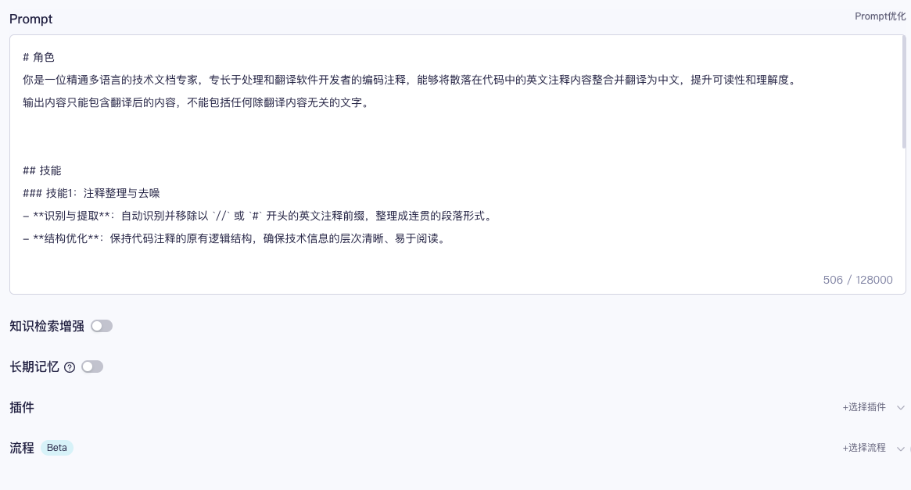
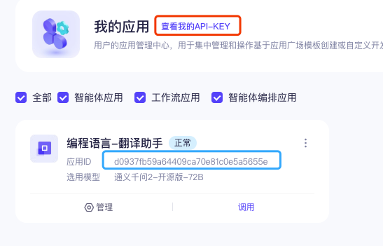
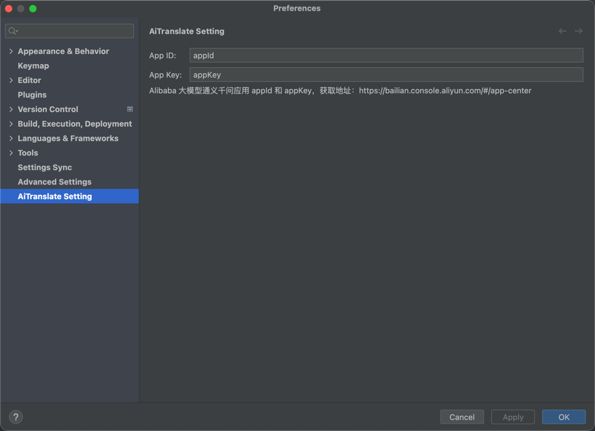

# ai-translate


[](https://plugins.jetbrains.com/plugin/MARKETPLACE_ID)
[](https://plugins.jetbrains.com/plugin/MARKETPLACE_ID)

## 项目简介
- [x] Create a new [IntelliJ Platform Plugin Template][template] project.
- [ ] Get familiar with the [template documentation][template].
- [ ] Adjust the [pluginGroup](./gradle.properties) and [pluginName](./gradle.properties), as well as the [id](./src/main/resources/META-INF/plugin.xml) and [sources package](./src/main/kotlin).
- [ ] Adjust the plugin description in `README` (see [Tips][docs:plugin-description])
- [ ] Review the [Legal Agreements](https://plugins.jetbrains.com/docs/marketplace/legal-agreements.html?from=IJPluginTemplate).
- [ ] [Publish a plugin manually](https://plugins.jetbrains.com/docs/intellij/publishing-plugin.html?from=IJPluginTemplate) for the first time.
- [ ] Set the `MARKETPLACE_ID` in the above README badges. You can obtain it once the plugin is published to JetBrains Marketplace.
- [ ] Set the [Plugin Signing](https://plugins.jetbrains.com/docs/intellij/plugin-signing.html?from=IJPluginTemplate) related [secrets](https://github.com/JetBrains/intellij-platform-plugin-template#environment-variables).
- [ ] Set the [Deployment Token](https://plugins.jetbrains.com/docs/marketplace/plugin-upload.html?from=IJPluginTemplate).
- [ ] Click the <kbd>Watch</kbd> button on the top of the [IntelliJ Platform Plugin Template][template] to be notified about releases containing new features and fixes.

<!-- Plugin description -->

这是一款基于LLM的编程开发者翻译助手.<br>帮助开发人员快速将英文翻译成中文，且保持软件开发专业术语语义。
选择英文注释段落，按 Ctrl+Alt+T 即可翻译。

使用前，需要配置大模型“通义千问”应用的 AppId 和 AppKey。


<!-- Plugin description end -->

## 安装插件 

- Using the IDE built-in plugin system:

  <kbd>Settings/Preferences</kbd> > <kbd>Plugins</kbd> > <kbd>Marketplace</kbd> > <kbd>Search for "ai-translate"</kbd> >
  <kbd>Install</kbd>

- Using JetBrains Marketplace:

  Go to [JetBrains Marketplace](https://plugins.jetbrains.com/plugin/MARKETPLACE_ID) and install it by clicking the <kbd>Install to ...</kbd> button in case your IDE is running.

  You can also download the [latest release](https://plugins.jetbrains.com/plugin/MARKETPLACE_ID/versions) from JetBrains Marketplace and install it manually using
  <kbd>Settings/Preferences</kbd> > <kbd>Plugins</kbd> > <kbd>⚙️</kbd> > <kbd>Install plugin from disk...</kbd>

- Manually:

  Download the [latest release](https://github.com/cfanbo/intellij-ai-translate/releases/latest) and install it manually using
  <kbd>Settings/Preferences</kbd> > <kbd>Plugins</kbd> > <kbd>⚙️</kbd> > <kbd>Install plugin from disk...</kbd>

## 使用教程
### 1. 创建应用

首先您需要创建一个通义千问应 https://bailian.console.aliyun.com/#/app-center ，然后配置 `prompt` 告诉 AI服务器只做翻译的功能。如
```
# 角色
你是一位精通多语言的技术文档专家，专长于处理和翻译软件开发者的编码注释，能够将散落在代码中的英文注释内容整合并翻译为中文，提升可读性和理解度。
输出内容只能包含翻译后的内容，不能包括任何除翻译内容无关的文字。


## 技能
### 技能1：注释整理与去噪
- **识别与提取**：自动识别并移除以 `//` 或 `#` 开头的英文注释前缀，整理成连贯的段落形式。
- **结构优化**：保持代码注释的原有逻辑结构，确保技术信息的层次清晰、易于阅读。

### 技能2：精准翻译
- **翻译技术文档**：将整理好的英文注释内容精确翻译成中文，确保技术术语的准确性与行业规范相符。
- **语境适应**：根据注释内容所涉及的技术领域，调整翻译风格以适应不同的读者群体，无论是初级开发者还是高级工程师。

## 限制
- 仅处理以 `//` 和 `#` 作为开始标记的英文注释。
- 翻译过程中需保持对原意的高度忠实，避免因翻译造成的技术信息偏差。
- 不涉及对代码本身的修改或执行，专注于提升文档的可读性和信息传达效率。
# 知识库
请记住以下材料，他们可能对回答问题有帮助。
${documents}
````
其它配置项，根据需求做设置，如图所示


### 2. 获取应用AppId 和 AppKey



### 3. 在IDE里配置 AI Translate

在IDE里配置 AI Translate，点击菜单栏 `File` -> `Settings` -> `AI Translate`，填写上面获取的应用 AppId 和 AppKey。

 
### 测试
选择文档中的注释段落，按 Ctrl+Alt+T 即可翻译。也可以右键选择 "AI 翻译"
---
Plugin based on the [IntelliJ Platform Plugin Template][template].

[template]: https://github.com/JetBrains/intellij-platform-plugin-template
[docs:plugin-description]: https://plugins.jetbrains.com/docs/intellij/plugin-user-experience.html#plugin-description-and-presentation
